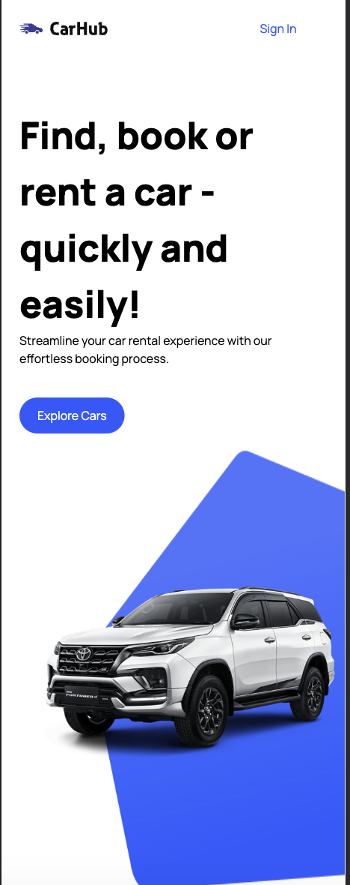

<h1 align="center">
    
</h1>

# Car Showcase

This is a landing page written to search for cars in catalog hub.
The idea of this project was to test and practice NextJs 13 features like async components, also responsive layouts.
I have used two apis in background to generate the data and content. Which are <strong>IMAGIN.studio</strong> and <strong>RapidApi</strong>.
You can find the deployed version <a href="https://car-showcase-rust.vercel.app">here</a>

## Content Table
<!--ts-->
   * [About](#about)
   * [Usage](#usage)
      * [Prerequisites](#prerequisites)
      * [Local files](#local-files)
      * [Commands](#commands)
   * [Features](#features)
   * [Technologies](#technologies)
<!--te-->

## Usage

To run the project you need to follow the steps below:

### Prerequisites
<ul style="list-style-type: none;" id="prerequisites">
  <li>Node v18 or higher</li>
  <li>IMAGIN.studio Api Key</li>
  <li>RapidAPI key</li>
</ul>

### Local Files
<ul style="list-style-type: none;" id="local-files">
  <li>NEXT_PUBLIC_IMAGIN_API_KEY (IMAGIN.studio)</li>
  <li>NEXT_PUBLIC_IMAGIN_HOST (IMAGIN.studio)</li>
  <li>RAPID_API_KEY (RapidApi)</li>
  <li>RAPID_API_HOST (RapidApi)</li>
</ul>

### Commands
<ul style="list-style-type: none;" id="local-files">
  <li>npm install</li>
  <li>npm run dev</li>
</ul>

## Features
<ul style="list-style-type: none;" id="features">
  <li>
    <h3>Home</h3>
    
  </li>
  <li>
    <h3>Car Details</h3>
     
  </li>
   <li>
      <h3>Mobile Version</h3>
      

        
        
        
      

  </li>

</ul>

## Technologies
<ul style="list-style-type: none;" id="features">
  <li>React 18</li>
  <li>Next.js 13.4</li>
  <li>Typescript</li>
  <li>TailwindCSS</li>
  <li>Vercel</li>
</ul>
